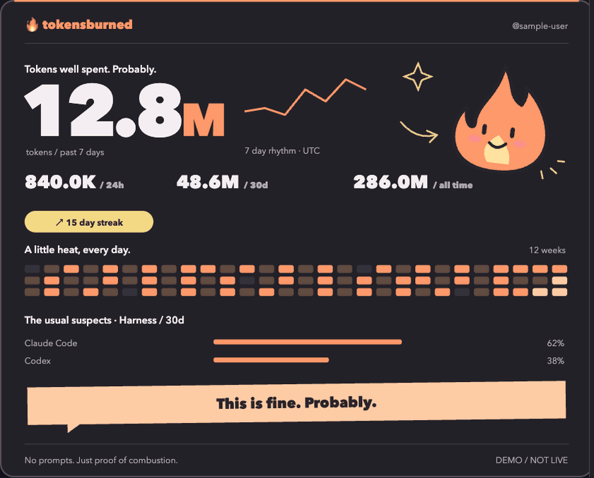

<div align="center"><h1>TokensBurned</h1><p><strong>Muestra tu actividad de programación con IA en GitHub sin subir prompts ni código fuente.</strong></p><p><a href="../../README.md">English</a> · <a href="README.zh-CN.md">简体中文</a> · <a href="README.ja.md">日本語</a> · <a href="README.ko.md">한국어</a> · <strong>Español</strong> · <a href="README.fr.md">Français</a></p></div>

<div align="center"><h3><a href="https://tokensburned.com/?lang=es#card-builder">Abrir el creador interactivo →</a></h3><p><sub>Elige diseño, tema claro/oscuro/automático y elementos. La vista previa usa datos ficticios locales.</sub></p></div>

TokensBurned recoge conteos de tokens y metadatos del modelo, los agrega localmente en bloques de 15 minutos y sirve un SVG vivo para tu perfil de GitHub. La tarjeta puede mostrar 24 horas, 7 días, 30 días, total histórico, mapas de calor, comparativas de harness/provider/model y una clasificación anónima.

<div align="center"></div>

## Instalación por harness

| Harness | Comando | Fuente de datos |
| --- | --- | --- |
| Claude Code | `/plugin marketplace add Parsifal1986/TokensBurned`<br>`/plugin install tokensburned@tokensburned`<br>`/tokensburned:connect` | Hook SessionEnd nativo + historial aprobado |
| Codex | `codex plugin marketplace add Parsifal1986/TokensBurned`<br>`codex plugin add tokensburned@tokensburned`<br>`$tokensburned:connect` | Plugin nativo + historial aprobado |
| Gemini CLI | `gemini extensions install https://github.com/Parsifal1986/TokensBurned`<br>`/tokensburned:connect`<br>`/tokensburned:telemetry` | GenAI OTLP oficial con `logPrompts=false` |
| Copilot CLI | `copilot plugin install https://github.com/Parsifal1986/TokensBurned` | Plugin + CLI/OTLP |
| Cline CLI | `cline plugin install https://github.com/Parsifal1986/TokensBurned.git` | `afterRun().result.usage` nativo |
| Otros | `npm install -g github:Parsifal1986/TokensBurned` | OTLP explícito o API batch |

Los hooks de Copilot todavía no exponen conteos de tokens, por lo que la recopilación sigue asistida por CLI. El plugin de Cline funciona en CLI, SDK y Kanban, no todavía en las extensiones de editor.

## Tarjeta de perfil

La tarjeta pública está desactivada por defecto. Primero ejecuta `tokensburned privacy public` para autorizar explícitamente la publicación de totales, harness/provider/model, mapas de actividad, rango e identidad de GitHub. Después usa el [constructor interactivo](https://tokensburned.com/?lang=es#card-builder). Los parámetros de URL solo pueden ocultar campos permitidos por el servidor.

```markdown
[](https://tokensburned.com/?lang=es)
```

- Compacta: `?layout=compact&compare=0&rank=1`
- Meme: `?layout=full&heatmap=0&compare=0&meme=1`
- Ocultar ranking: `&rank=0`
- Seguir el tema del sistema: `&theme=auto`
- Fijar claro u oscuro: `&theme=light` / `&theme=dark`

## Privacidad

Solo salen del equipo los conteos de tokens, harness, provider, model, un session ID con hash, el bloque de 15 minutos y el número de peticiones. Nunca se suben prompts, respuestas, código, nombres o rutas de repositorios ni API keys. Los datos del servidor se conservan hasta ejecutar `tokensburned delete-server-data`; la credencial caduca a los 180 días. Consulta [SECURITY.md](../../SECURITY.md).

[MIT License](../../LICENSE) © 2026 parsifal1986
