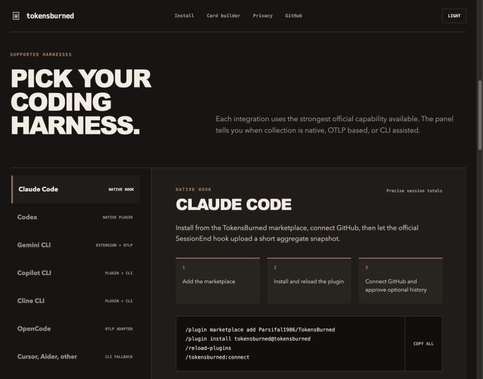

<div align="center">
  
  <h1>TokensBurned</h1>
  <p><strong>把 AI 编程活动放进 GitHub Profile，但不上传提示词和源代码。</strong></p>
  <p><a href="../../README.md">English</a> · <strong>简体中文</strong> · <a href="README.ja.md">日本語</a> · <a href="README.ko.md">한국어</a> · <a href="README.es.md">Español</a> · <a href="README.fr.md">Français</a></p>
</div>

<div align="center">
  <h3><a href="https://tokensburned.com/?lang=zh-CN#card-builder">打开在线卡片构建器 →</a></h3>
  <p><sub>选择版式、浅色/深色/自动主题和显示内容。预览只使用本地虚构数据。</sub></p>
</div>

TokensBurned 从不同 AI coding harness 收集 token 数量和模型元数据，在本地归并为 15 分钟桶，再生成一张持续更新的 GitHub Profile SVG。卡片可以显示过去 24 小时、7 天、30 天和总计用量，日历与时段热力图，harness/provider/model 对比，以及匿名站内排名。

<div align="center"></div>

## 为什么用 TokensBurned

- **只嵌入一次。** SVG 会在服务器端更新，不需要定时任务，也不会制造难看的 README commit。
- **区分三层身份。** Claude Code 是 harness，不等于模型一定是 Claude。provider 和 model 会分别记录。
- **先在本地缩减。** 原始 session 不会被上传，客户端只输出允许的聚合字段。
- **清晰的隐私边界。** 不上传提示词、回复、源代码、仓库名、transcript 路径和 API key。
- **不夸大兼容性。** 原生 hook、官方 OTLP、适配器和 CLI fallback 会明确标注。

## 按 harness 安装

<div align="center"></div>

<table>
  <tr>
    <td width="50%" valign="top">
      <h3>Claude Code</h3><p><strong>原生插件 + SessionEnd hook</strong></p>
      <pre><code>/plugin marketplace add Parsifal1986/TokensBurned
/plugin install tokensburned@tokensburned
/reload-plugins
/tokensburned:connect</code></pre>
      <p>预览历史导入：<code>/tokensburned:backfill --dry-run --days 90</code></p>
    </td>
    <td width="50%" valign="top">
      <h3>Codex</h3><p><strong>原生 marketplace 插件 + 三个独立 skill</strong></p>
      <pre><code>codex plugin marketplace add Parsifal1986/TokensBurned
codex plugin add tokensburned@tokensburned</code></pre>
      <p>新建 task 后使用：</p>
      <pre><code>$tokensburned:connect
$tokensburned:backfill
$tokensburned:server</code></pre>
    </td>
  </tr>
  <tr>
    <td width="50%" valign="top">
      <h3>Gemini CLI</h3><p><strong>官方 Extension + GenAI OpenTelemetry</strong></p>
      <pre><code>gemini extensions install https://github.com/Parsifal1986/TokensBurned
gemini
/tokensburned:connect
/tokensburned:telemetry</code></pre>
      <p>配置过程会保持 <code>logPrompts=false</code>，只发送经过 allow-list 的 token 和身份字段。</p>
    </td>
    <td width="50%" valign="top">
      <h3>GitHub Copilot CLI</h3><p><strong>Open Plugin Spec + CLI 数据路径</strong></p>
      <pre><code>copilot plugin install https://github.com/Parsifal1986/TokensBurned</code></pre>
      <p>Copilot hook 暂时不提供 token 总数，所以插件工作流是原生的，但统计仍由 CLI 或外部 OTLP 提供。</p>
    </td>
  </tr>
  <tr>
    <td width="50%" valign="top">
      <h3>Cline CLI</h3><p><strong>原生 afterRun 用量 hook</strong></p>
      <pre><code>cline plugin install https://github.com/Parsifal1986/TokensBurned.git</code></pre>
      <p>只读取 Cline 返回的 <code>result.usage</code>。目前 Cline 插件仅适用于 CLI、SDK 和 Kanban。</p>
    </td>
    <td width="50%" valign="top">
      <h3>OpenCode、Cursor、Aider 等</h3><p><strong>OTLP 或独立 CLI</strong></p>
      <pre><code>npm install -g github:Parsifal1986/TokensBurned
tokensburned connect
tokensburned doctor</code></pre>
      <p>只有 harness 能提供观测到的 token 字段时才走 OTLP。TokensBurned 不会根据提示词长度猜 token。</p>
    </td>
  </tr>
</table>

## 生成 GitHub Profile 卡片

打开[在线卡片构建器](https://tokensburned.com/?lang=zh-CN#card-builder)，输入 GitHub 用户名，选择完整版、紧凑版或 meme 版，然后复制生成的 Markdown。

```markdown
[](https://tokensburned.com/?lang=zh-CN)
```

下面使用的是仓库内置的虚构静态数据，浏览 README 不会请求 TokensBurned API。

<div align="center"></div>

### 常用组合

| 效果 | 参数 |
| --- | --- |
| 完整报告 | `?layout=full&heatmap=1&compare=1&rank=1&meme=0` |
| 紧凑总计 | `?layout=compact&compare=0&rank=1` |
| Meme 小票 | `?layout=full&heatmap=0&compare=0&rank=1&meme=1` |
| 隐藏排名 | 在任意链接后添加 `&rank=0` |
| 只保留对比 | `?layout=full&heatmap=0&compare=1` |
| 跟随系统主题 | `&theme=auto` |
| 固定浅色或深色 | `&theme=light` 或 `&theme=dark` |

## CLI fallback

```bash
npm install -g github:Parsifal1986/TokensBurned
tokensburned connect
```

常用命令：

- `tokensburned backfill --harness codex --dry-run`：只在本地预览 Codex 历史。
- `tokensburned backfill --harness claude-code --days 30`：导入明确批准的 Claude Code 时间范围。
- `tokensburned backfill --all-harnesses --days 30`：显式扫描所有已识别 harness。
- `tokensburned server`：查看服务端统计与公开 SVG 地址。
- `tokensburned doctor`：查看检测结果和所有数据边界。

## 隐私边界

| 会上传 | 永不上传 |
| --- | --- |
| token 数量 | 提示词和回复 |
| harness、provider、model | 源代码和工具 payload |
| 哈希后的 session ID | 仓库名与路径 |
| 15 分钟时间桶 | transcript 文件与路径 |
| 请求次数 | API key 与 provider 凭证 |

TokensBurned 不安装 cron、daemon、proxy 或 Git 同步任务。完整说明见 [SECURITY.md](../../SECURITY.md)。项目采用 [MIT License](../../LICENSE)。
